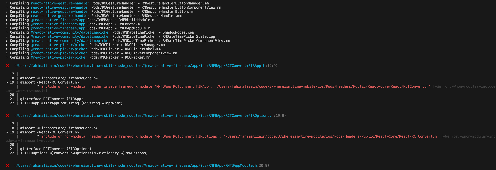

# Expo 54 iOS "Include of non-modular header inside framework module" Build Issue

When running `npm run ios`, during the ios build phase we got the following error:


- Main Github Issue: [invertase/react-native-firebase#8657](https://github.com/invertase/react-native-firebase/issues/8657)
- Why this happens: [source](https://github.com/invertase/react-native-firebase/issues/8657#issuecomment-3291550747)
- Cocoapods is being discussed to be removed from React Native instead of SPM (Swift Package Manager): [Discussion](https://github.com/react-native-community/discussions-and-proposals/issues/587#issuecomment-2777982810)
- A reasonable comment on this issue: [source](https://github.com/invertase/react-native-firebase/issues/8657#issuecomment-3667922545). The solution suggested has been applied on this repo.
- We only use the following Pods at the moment: `['RNFBApp', 'RNFBAuth', 'RNFBCrashlytics']`

## Solution

```js
{
  plugins: [
    [
      // 'expo-build-properties' must be first. See https://github.com/invertase/react-native-firebase/issues/8657#issuecomment-3312082933
      'expo-build-properties',
      {
        ios: {
          /**
           * RNFirebase iOS build fix using static linking (maintainer-recommended).
           *
           * We previously used `buildReactNativeFromSource: true` as a workaround to fix
           * RNFirebase + Firebase iOS SDK build issues, but it disabled Expo’s precompiled RN for
           * iOS builds and significantly increased build times.
           * - N.B. For links & context on why `buildReactNativeFromSource: true` was added,
           * refer to comments in the "previous commit".
           *
           * This `forceStaticLinking` configuration follows the Expo maintainer’s suggested solution:
           * https://github.com/expo/expo/issues/39607#issuecomment-3337284928
           * - Now precompiled builds are enabled and build times are reduced and RNFB builds work on iOS.
           *
           * ⚠️ IMPORTANT: If installing/removing react-native-firebase npm packages, ensure you also update this list.
           * - Look for `s.name` property in node_modules/@react-native-firebase/<module>/<module>.podspec to get the Pod name.
           */
          forceStaticLinking: [
            'RNFBAnalytics',
            'RNFBApp',
            'RNFBCrashlytics',
            'RNFBInAppMessaging',
            'RNFBInstallations',
            'RNFBPerf',
          ],
          /**
           * Helps RNFB to compile correctly on iOS, since firebase-ios-sdk requires use_frameworks
           * @see https://rnfirebase.io/#configure-react-native-firebase-modules
           */
          useFrameworks: 'static',
        },
      },
    ],
    '@react-native-firebase/app',
    '@react-native-firebase/crashlytics',
    '@react-native-firebase/perf',

    // put other plugins after `expo-build-properties`
    'expo-router',
    'expo-localization',
  ];
}
```
